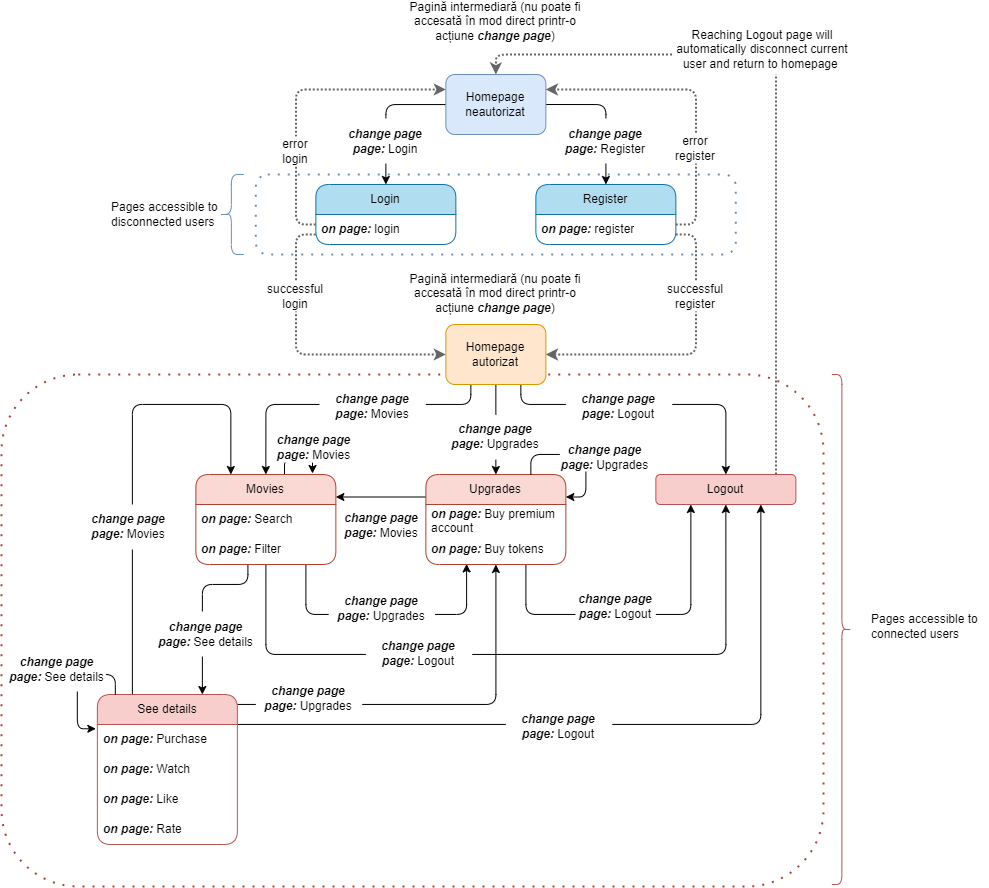

[![MIT License][license-shield]][license-url]
![Homework][homework-shield]

<!-- PROJECT LOGO -->
 

  

<h3 align="center">Streaming Platform / POO TV</h3>

  

    Second Object Oriented Programming homework, a Java simulation of a streaming platform.
     
     
    <a href="https://github.com/miron-boiangiu/streaming_platform/issues">Report Bug</a>
    ·
    <a href="https://github.com/miron-boiangiu/streaming_platform/issues">Request Feature</a>
  

<!-- TABLE OF CONTENTS -->

  
Table of Contents

  <ol>
    <li>
      <a href="#about-the-project">About The Project</a>
      <ul>
        <li><a href="#built-with">Built With</a></li>
      </ul>
    </li>
    <li>
      <a href="#getting-started">Getting Started</a>
      <ul>
        <li><a href="#prerequisites">Prerequisites</a></li>
      </ul>
    </li>
    <li><a href="#usage">Usage</a></li>
    <li><a href="#license">License</a></li>
    <li><a href="#contact">Contact</a></li>
  </ol>

<!-- ABOUT THE PROJECT -->
## About The Project

Coded in Java, this project simulates the back-end of a streaming platform, allowing users to create new accounts, buy and watch movies, rate them and get recommendations based on their preferences.

<a href="https://ocw.cs.pub.ro/courses/poo-ca-cd/teme/proiect/etapa1">Assignment link 1.</a>

<a href="https://ocw.cs.pub.ro/courses/poo-ca-cd/teme/proiect/etapa2">Assignment link 2.</a>

(<a href="#top">back to top</a>)

### Built With

* [Java](https://www.java.com/en/)

(<a href="#top">back to top</a>)

<!-- GETTING STARTED -->
## Getting Started

### Prerequisites

* A JDK version ([OpenJDK](https://openjdk.org/)/[Oracle JDK](https://www.oracle.com))
* [Lombok](https://projectlombok.org/)
* [Jackson](https://github.com/FasterXML/jackson)

Note: both Lombok and Jackson have a version included in the repository.

### Compilation

I recommend using a build system to compile the source to bytecode and run it:
* [Maven](https://maven.apache.org/)
* [Gradle](https://gradle.org/)

(<a href="#top">back to top</a>)

<!-- USAGE EXAMPLES -->
## Usage

As of right now, the project supports simulating the inputs of one user at a time, whose interactions with the "server" are being read from a JSON file. The user can browse the platform, there being several accessible pages, and buy movies, watch movies, subscribe to a genre, etc. Below is a diagram showing the pages of the platform:

The following functionalities have been implemented:

* New users start with a number of tokens by default, which they can spend on buying new movies. If the user is a premium one, then the first couple of movies they buy are free of charge.

* The platform supports showing certain movies only in specific countries, where they are licensed.

* Users can rate movies they have watched.

* Users can go back to a previous page they had been on.

* Admins can easily add new movies and users that have subscribed to at least one of that movies' genres will be notified of its addition (if it's available in their country).

Note: In case you find anything unclear or too vague, please consult the assignment link and README_OLD.md .

 

(<a href="#top">back to top</a>)

<!-- LICENSE -->
## License

Distributed under the MIT License. See `LICENSE.txt` for more information.

(<a href="#top">back to top</a>)

<!-- CONTACT -->
## Contact

Boiangiu Victor-Miron - miron.boiangiu@gmail.com

Project Link: [https://github.com/miron-boiangiu/streaming_platform](https://github.com/miron-boiangiu/streaming_platform)

(<a href="#top">back to top</a>)

<!-- MARKDOWN LINKS & IMAGES -->
<!-- https://www.markdownguide.org/basic-syntax/#reference-style-links -->
[contributors-shield]: https://img.shields.io/github/contributors/miron-boiangiu/streaming_platform.svg?style=for-the-badge
[contributors-url]:https://github.com/miron-boiangiu/streaming_platform/graphs/contributors
[forks-shield]: https://img.shields.io/github/forks/miron-boiangiu/streaming_platform.svg?style=for-the-badge
[forks-url]:https://github.com/miron-boiangiu/streaming_platform/network/members
[stars-shield]: https://img.shields.io/github/stars/miron-boiangiu/streaming_platform.svg?style=for-the-badge
[stars-url]:https://github.com/miron-boiangiu/streaming_platform/stargazers
[issues-shield]: https://img.shields.io/github/issues/miron-boiangiu/streaming_platform.svg?style=for-the-badge
[issues-url]:https://github.com/miron-boiangiu/streaming_platform/issues
[license-shield]: https://img.shields.io/github/license/miron-boiangiu/streaming_platform.svg?style=for-the-badge
[license-url]:https://github.com/miron-boiangiu/streaming_platform/blob/main/LICENSE
[linkedin-shield]: https://img.shields.io/badge/-LinkedIn-black.svg?style=for-the-badge&logo=linkedin&colorB=555
[linkedin-url]: https://linkedin.com/in/miron-boiangiu
[product-screenshot]: images/screenshot.png
[homework-shield]: https://img.shields.io/badge/UPB-Homework-%23deeb34?style=for-the-badge

